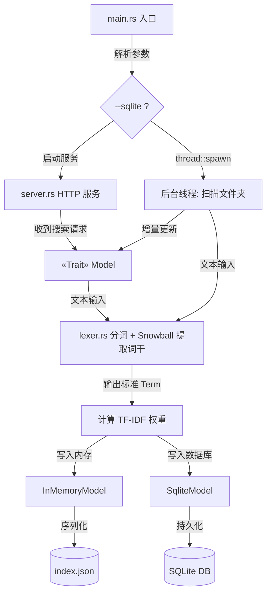

# searchenginee

### 系统架构图

```mermaid
graph TD
    A[main.rs 入口] -->|解析参数| B{--sqlite ?}

    %% 前台服务
    B -->|启动服务| C[server.rs HTTP 服务]
    C -->|收到搜索请求| D[«Trait» Model]

    %% 后台索引
    B -->|thread::spawn| E[后台线程: 扫描文件夹]
    E -->|增量更新| D

    %% 文本引擎
    E & D -->|文本输入| F[lexer.rs 分词 + Snowball 提取词干]
    F -->|输出标准 Term| G[计算 TF-IDF 权重]

    %% 存储双轨制
    G -->|写入内存| H[InMemoryModel] -->|序列化| I[(index.json)]
    G -->|写入数据库| J[SqliteModel] -->|持久化| K[(SQLite DB)]
```

